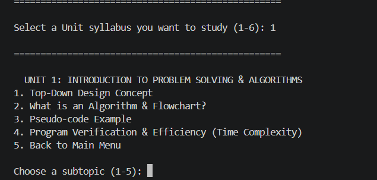

# Interactive Python Learning Sathi

A simple Python program that helps first-semester students learn and revise Python topics. It has a menu where you can read about each unit and then take a quiz to check how much you understood.

## About the Project

When I started learning Python in my first semester, I felt it would be easier to revise if the notes and the practice questions were in one place. So I made this console-based app. You can pick a unit, read the concepts, and then try the quiz to see your score. I made it for my VITyarthi "Build Your Own Project" submission.

## Features

- Main menu to move between all the units
- Separate study section for each unit
- Quiz mode that shows your score at the end
- Easy-to-use console (terminal) interface
- Code is divided into different files so it is easy to understand and add more things later

## Units Covered

- Unit 1: Problem solving and algorithms
- Unit 2: Python data types, expressions and statements
- Unit 3: Control flow, loops and basic algorithms
- Unit 4: Factors, GCD and prime numbers
- Unit 5: Arrays, lists and working with collections

## Technologies Used

- Python 3
- `unittest` (built-in Python module) for testing
- Git and GitHub for version control
- VS Code as the code editor

## Project Structure

```
Project/
├── main.py
├── Data/
│   └── Quiz.py
├── Help_utilities/
│   └── Clear_screen.py
├── Modules/
│   ├── Unit_1.py
│   ├── Unit_2.py
│   ├── Unit_3.py
│   ├── Unit_4.py
│   └── Unit_5.py
├── Screenshots/
│   ├── Main menu.png
│   ├── Quiz result.png
│   └── Unit selection.png 
├── Tests/
│   └── test_functions.py
└── README.md

```

The `report/diagrams` folder has the diagrams I made for the project report (architecture, sequence, use case and workflow).

## How to Run

1. Install Python 3 on your computer if you don't have it already.
2. Download or clone this repository.
3. Open a terminal in the project folder and type:

```python main.py```

On Windows you can also use:

```py main.py```

4. The main menu will open. From there you can choose a unit, start the quiz, or exit.

## How to Test

I wrote some unit tests for the menu and the quiz. To run them, use this command in the project folder:

```python -m unittest discover -s Tests```

If everything is working, all the tests will pass.

## Screenshots

*(Add your screenshots here)*

| Main Menu | Unit Section | Quiz Result |
|-----------|--------------|-------------|
|  |  |  |

## Who Can Use This

- Beginners who are learning Python for the first time
- Students who want to revise before exams
- Anyone who wants a small terminal-based project example

## Future Improvements

- Add more quiz questions for every unit
- Add a difficulty level (easy / medium / hard)
- Save the scores so students can track their progress

## Note

This project was made for learning purposes. You are free to use it or change it for your own practice.